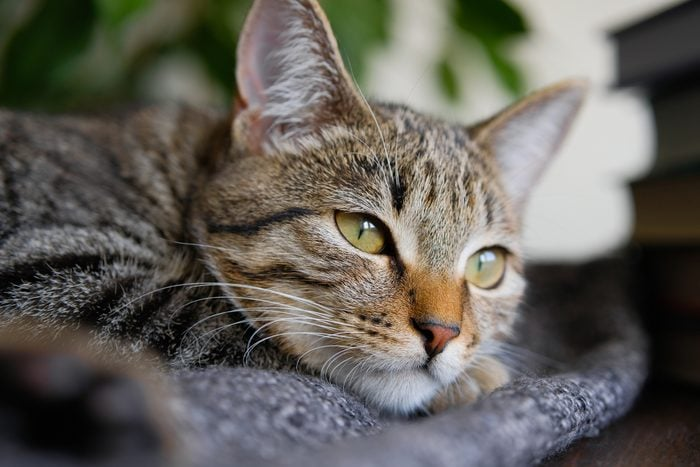
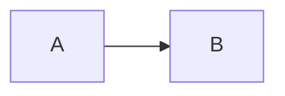
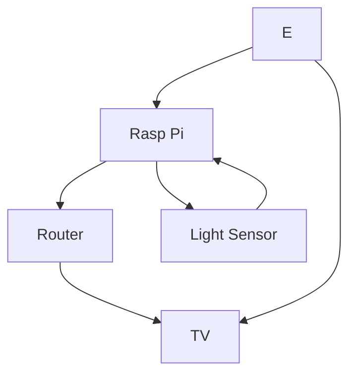

# EGL315

## Name
Lin Lai Yi Mon

*Lin Lai Yi Mon*

**Lin Lai Yi Mon**

***Lin Lai Yi Mon***

## School
NYP

### Code Block
```
I am at Nanyang Polytechnic
Blk S
Room 540
```

### Code Line
`sudo raspi-config`

## Adding Picture

Cute picture of a cat



## Block Diagram

Left to Right

Top to Down
